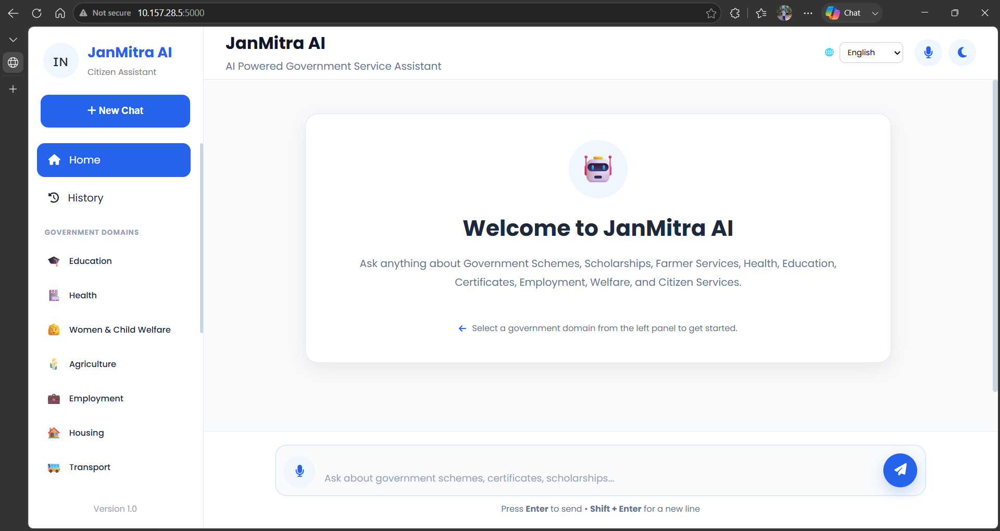
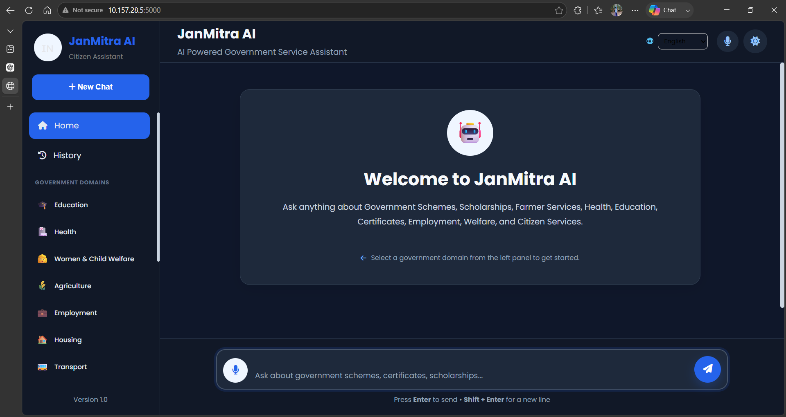
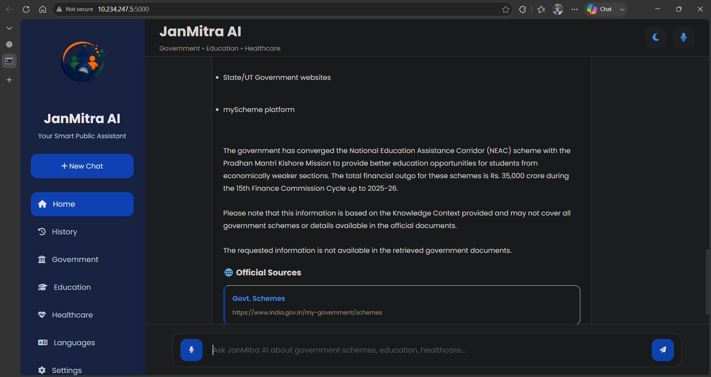

# 🇮🇳 JanMitra AI

### A Multilingual AI Assistant for Government Schemes and Services

JanMitra AI is a language-agnostic AI assistant designed to help citizens access information about government schemes and services through a simple conversational interface.

The system combines web scraping, natural language processing, multilingual processing, semantic retrieval, hybrid search, and a Large Language Model to provide relevant information from government sources.

---

## 🎯 Problem Statement

Government scheme and service information is distributed across numerous central government, state government, and departmental websites.

Citizens may face difficulties because:

- Information is spread across multiple websites.
- Government portals contain large amounts of text.
- Finding relevant information manually can be time-consuming.
- Users may prefer communicating in regional languages.
- Understanding eligibility, benefits, and application information can be difficult.

JanMitra AI aims to provide a unified conversational interface for accessing this information.

---

## 💡 Proposed Solution

JanMitra AI collects information from government websites and processes it into a searchable knowledge base.

When a user asks a question:

1. The query is processed.
2. Relevant information is retrieved from the knowledge base.
3. Semantic and keyword-based retrieval are combined.
4. Relevant content is reranked.
5. The retrieved context is provided to the Large Language Model.
6. The system generates a conversational response.

---

## 🏗️ System Architecture

```text
Government Websites
        ↓
Intelligent Web Crawler
        ↓
Data Processing
        ↓
Knowledge Repository
        ↓
Document Chunking
        ↓
Embedding Generation
        ↓
FAISS Vector Database
        ↓
Hybrid Retrieval
   ↙            ↘
Semantic       Keyword
 Search         Search
   ↘            ↙
     Reranking
         ↓
   Query Processing
         ↓
    Qwen + Ollama
         ↓
    Flask Interface
         ↓
       User
```

---

## 🖥️ JanMitra AI Interface

JanMitra AI provides a conversational interface for accessing government schemes and services.

### 🏠 Home Page — Light & Dark Themes



### 💻 Home Page



### 💬 Chatbot Response



### 🏗️ Project Architecture


---

## ⚙️ Technology Stack

| Component | Technology |
|---|---|
| Programming Language | Python |
| Web Scraping | Scrapy, BeautifulSoup, Requests |
| Data Processing | Python |
| Embeddings | Sentence Transformers |
| Vector Database | FAISS |
| Retrieval | Semantic + Keyword Hybrid Retrieval |
| Reranking | Relevance Scoring |
| Large Language Model | Qwen |
| Local LLM Runtime | Ollama |
| Backend | Flask |
| Voice Processing | Vosk / ONNX-based components |
| Frontend | HTML, CSS, JavaScript |

---

## 🔍 Key Features

### 🌐 Government Information Retrieval

Collects and processes information from government websites and departmental portals.

### 🧠 Retrieval-Augmented Generation

Relevant information is retrieved from the knowledge base before generating an answer using the Large Language Model.

### 🔎 Hybrid Retrieval

JanMitra AI combines:

- Semantic search
- Keyword-based search
- Relevance scoring
- Reranking

to improve the retrieval of relevant information.

### 🌍 Multilingual Interaction

The system is designed to support queries across multiple Indian languages, enabling users to interact with government information in their preferred language.

### 🤖 Local AI Inference

Qwen is used through Ollama for local Large Language Model inference.

### 🎤 Voice Interaction

The project includes voice-processing components to support speech-based interaction.

### 💬 Conversational Interface

A Flask-based web interface allows users to interact with JanMitra AI through a chatbot-style interface.

---

## 🔄 Query Processing Pipeline

```text
User Query
    ↓
Language Detection
    ↓
Query Processing
    ↓
Keyword Extraction
    ↓
Semantic Embedding
    ↓
Hybrid Retrieval
    ↓
Reranking
    ↓
Relevant Context
    ↓
Qwen LLM
    ↓
Generated Response
```

---

## 📂 Project Structure

```text
JanMitra/
│
├── app/
│   ├── data/
│   ├── retrieval/
│   ├── models/
│   ├── processing/
│   ├── voice/
│   └── ...
│
├── tests/
│
├── voice/
│
├── docs/
│   └── images/
│       ├── themes.png
│       ├── home.png
│       ├── chatbot.png
│       └── architecture.png
│
├── run.py
├── generate_embeddings.py
├── build_vector_db.py
├── requirements.txt
├── README.md
└── .gitignore
```

---

## 🚀 Installation

### 1. Clone the Repository

```bash
git clone git@github.com:dhiyaneshwar609/JanMitra.git
cd JanMitra
```

### 2. Create a Virtual Environment

```bash
python -m venv venv
```

### 3. Activate the Virtual Environment

#### Windows

```bash
venv\Scripts\activate
```

### 4. Install Dependencies

```bash
pip install -r requirements.txt
```

### 5. Configure Environment Variables

Create a `.env` file and add the required configuration.

> `.env` is intentionally excluded from the repository for security.

### 6. Run the Application

```bash
python run.py
```

---

## 🧮 Embedding and Vector Index Generation

After preparing the processed dataset, generate embeddings using:

```bash
python generate_embeddings.py
```

Then build the FAISS vector index:

```bash
python build_vector_db.py
```

---

## 💬 Example Queries

Users can ask questions such as:

```text
What scholarships are available for students?

What government schemes are available for farmers?

மாணவர்களுக்கு கிடைக்கும் கல்வி உதவித்தொகைகள் என்னென்ன?

What are the eligibility requirements for this scheme?
```

---

## 🏆 Achievement

### 🥇 First Prize — IEEE Student Paper Contest 2026

JanMitra AI was presented at the IEEE Student Paper Contest 2026 conducted at:

**Vel Tech Rangarajan Dr. Sagunthala R&D Institute of Science and Technology**

The project received **First Prize** in the student paper presentation contest.

---

## 👨‍💻 Team

### Dhiyaneshwar A

B.Tech — Artificial Intelligence & Data Science

### Deepika N

B.Tech — Artificial Intelligence & Data Science

---

## 👩‍🏫 Mentor

**M. Vasanthapriya**  
Assistant Professor  
Department of Artificial Intelligence & Data Science  
P.T.Lee Chengalvaraya Naicker College of Engineering and Technology

---

## 🔮 Future Scope

Future improvements include:

- Expanding government website coverage
- Improving multilingual retrieval accuracy
- Adding more Indian regional languages
- Improving voice-based interaction
- Enhancing retrieval and reranking
- Adding more government services and departments
- Continuous updating of government information
- Improving response accuracy and reliability

---

## 📌 Project Status

JanMitra AI is an ongoing academic and research project focused on building an accessible multilingual AI interface for government schemes and services.

---

## 📜 License

This project is developed for academic and research purposes.
