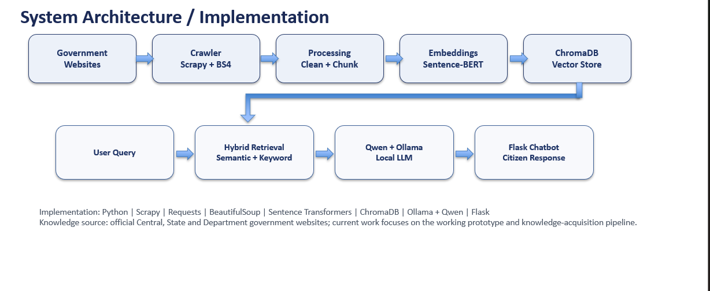

# 🇮🇳 JanMitra AI

### A Multilingual AI Assistant for Government Schemes and Services

JanMitra AI is a language-agnostic AI assistant designed to help citizens access information about government schemes and services through a simple conversational interface.

The system combines web scraping, natural language processing, multilingual processing, semantic retrieval, hybrid search, and a Large Language Model to provide relevant information from government sources.

---

## 🎯 Problem Statement

Government scheme and service information is distributed across numerous central government, state government, and departmental websites.

Citizens may face difficulties because:

- Information is spread across multiple websites.
- Government portals contain large amounts of text.
- Finding relevant information manually can be time-consuming.
- Users may prefer communicating in regional languages.
- Understanding eligibility, benefits, and application information can be difficult.

JanMitra AI aims to provide a unified conversational interface for accessing this information.

---

## 💡 Proposed Solution

JanMitra AI collects information from government websites and processes it into a searchable knowledge base.

When a user asks a question:

1. The query is processed.
2. Relevant information is retrieved from the knowledge base.
3. Semantic and keyword-based retrieval are combined.
4. Relevant content is reranked.
5. The retrieved context is provided to the Large Language Model.
6. The system generates a conversational response.

---

## 🏗️ System Architecture

```text
Government Websites
        ↓
Intelligent Web Crawler
        ↓
Data Processing
        ↓
Knowledge Repository
        ↓
Document Chunking
        ↓
Embedding Generation
        ↓
FAISS Vector Database
        ↓
Hybrid Retrieval
   ↙            ↘
Semantic       Keyword
 Search         Search
   ↘            ↙
     Reranking
         ↓
   Query Processing
         ↓
    Qwen + Ollama
         ↓
    Flask Interface
         ↓
       User

---

## 🖥️ JanMitra AI Interface

JanMitra AI provides a conversational interface for accessing government schemes and services.

### 🏠 Home Page — Light Theme


### 🌙 Home Page — Dark Theme


### 💬 Chatbot Response


### 🏗️ Project Architecture

